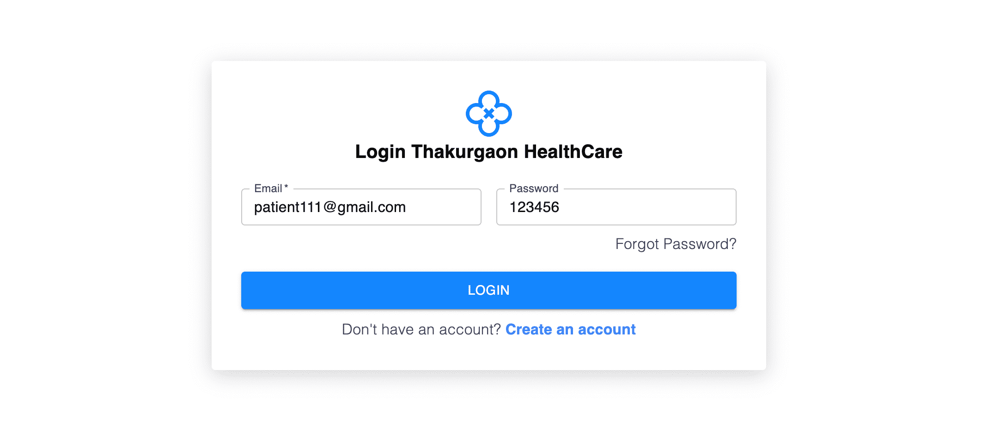
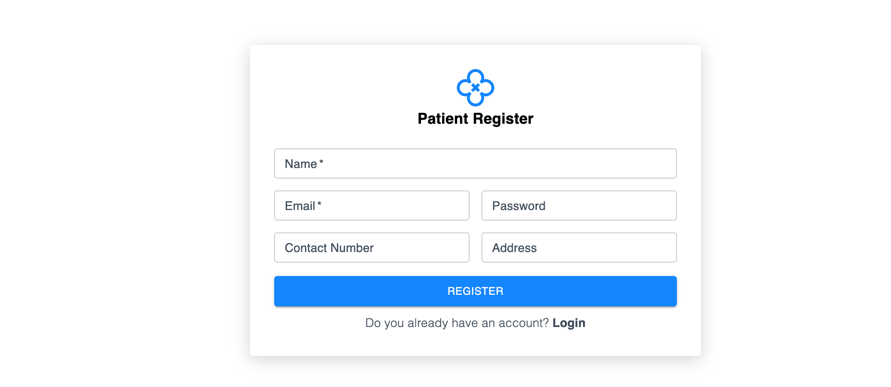

## 1st. Run Posgresql local machine

- git clone 

Run the server:
create `.env`

-    cd client
-    npm install 
-    npm run dev
- 
Run the Client:
create `.env`

-    npm server 
-    npm install 
-    npm run dev

- `npx prisma migrate dev`

**part-1 [Server Configure]**
- 6. Clone Server Install dependencies and configure `.env`
- 7. Insatall `PostgreSQL` and connect to the `database`
- 8. Generate Gmail app for and configure it in `.evn`
- 9. Cloudinary Account creation and configure to .env`
- 10. Create SSCL Commerce account and configure it to `

--- 

**🔲 part-4 [Reusable+rtk+axios+]**

⏩  No rtk operation were performed. 
⏩ just performed the login and register operation based on react hook form

- 1. [Make Resualbe Form](https://react-hook-form.com/docs/formprovider)
- 2. [Make Resualbe Input and Make Login User Componet](https://react-hook-form.com/docs/usecontroller/controller) 
- 3. Make Registration
- 4. Add Validation using `zod` 
    - `npm install zod`
    - `npm install @hookform/resolvers zod`
- 5. Setting Default Value and Custom Error Messages
- 6. Setting Default Value Validation for Patient Registration
- 7. Display Error Messages in Login Form
- 8. [Install redux-toolkit](https://redux-toolkit.js.org/tutorials/quick-start)
    - `npm install @reduxjs/toolkit react-redux`
- 9. [Install axios](https://redux-toolkit.js.org/rtk-query/usage/customizing-queries#examples---basequery)
    - `npm install axios`
- 10. Create Dashboard test layout

-
**🔲 part-3 [Login+ Logout + Register Functionable using server action]**
- 1. Create Patient Register Page
- 2. Create User Login Page
- 3. Get Input Field From Valuses Using React Hook Form
- 4. Modify Patient Data into Form Data
- 5. Register Patient Server Fuctionality 
- 6. Implement Login User Server Fuctionality 
- 7. Set Token in `Browser Local Storage `
- 8. Retrive User info from `Browser Local Storage `
- 9. Implement Logout Functionality
- 10. Implement lazy loading to Navbar component

Project:

 
